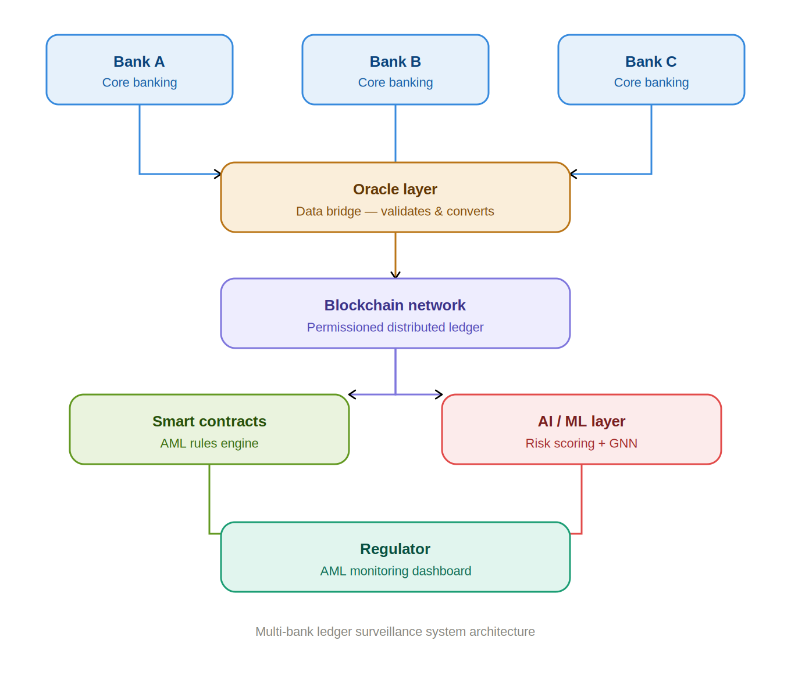
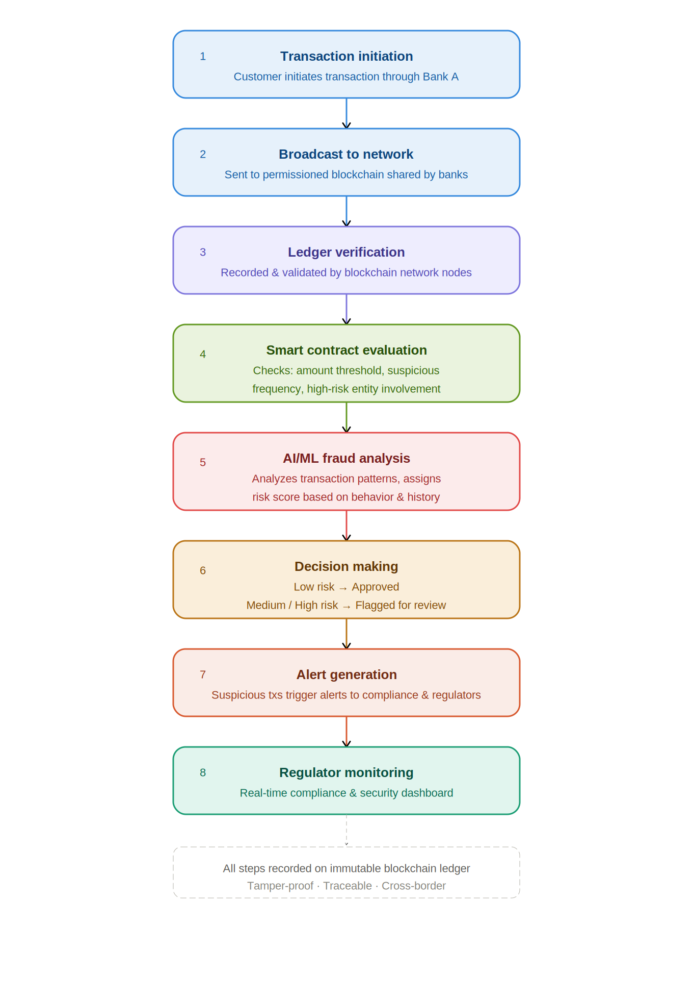
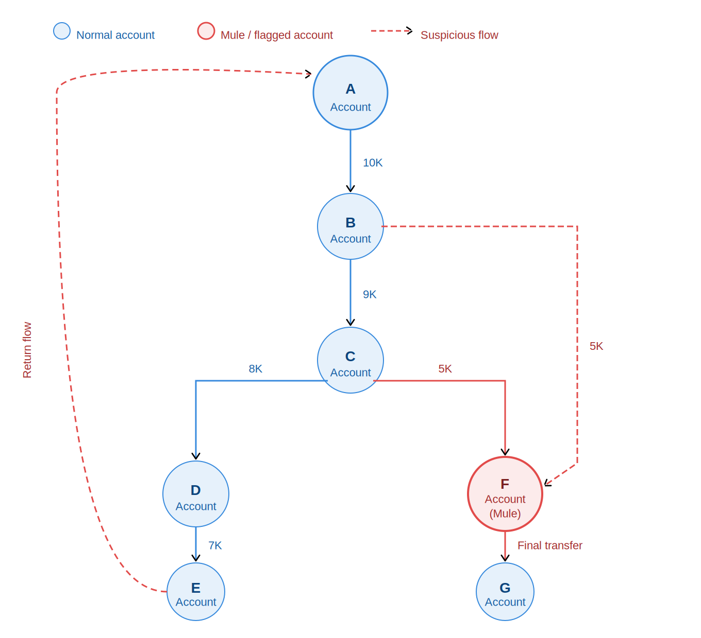

# Blockchain-Based AML/CFT Monitoring & Financial Crime Detection

An enterprise fintech framework that replaces isolated banking database silos with a decentralized, real-time approach to cross-border financial surveillance. The system fuses permissioned ledgers, smart contracts, and deep Graph Neural Networks (GNN) to track illicit financial trails.

---

## What it Does

* **Unified Ledger State:** Eliminates cross-border tracking delays by maintaining a single, shared view of transactions across international banking networks.
* **Smart Contract Automation:** Instantly triggers compliance alerts and enforces transaction limits or blocks on-chain without waiting for manual audits.
* **GNN Behavior Learning:** Maps transactions to expose complex, multi-hop layering loops and hidden shell account structures.
* **Federated Learning Privacy:** Trains predictive AI models locally at individual bank nodes to protect sensitive customer data and comply with global privacy laws.

---

## System Architecture & Workflows

Here are the core workflow diagrams and structural frameworks designed for this project:

### System Architecture Layers

### In-Flight Transaction Lifecycle Workflow

### Deep Graph Behavioral Neural Network (GNN) Model

---

## File Directory

* `aml_cft_blockchain_simulator.html` — The master interactive briefing deck containing the live rules engine and graph tracking simulation.
* `Blockchain_AMLCFT_Presentation.pptx` — The core technology briefing presentation deck.
* `AML-Blockchain-Architecture.png` — System structural layout chart.
* `AML-Blockchain-Workflow.png` — Step-by-step transaction processing flow.
* `GNN-Fraud-Network-Clean.png` — Relational graph network visualization.
